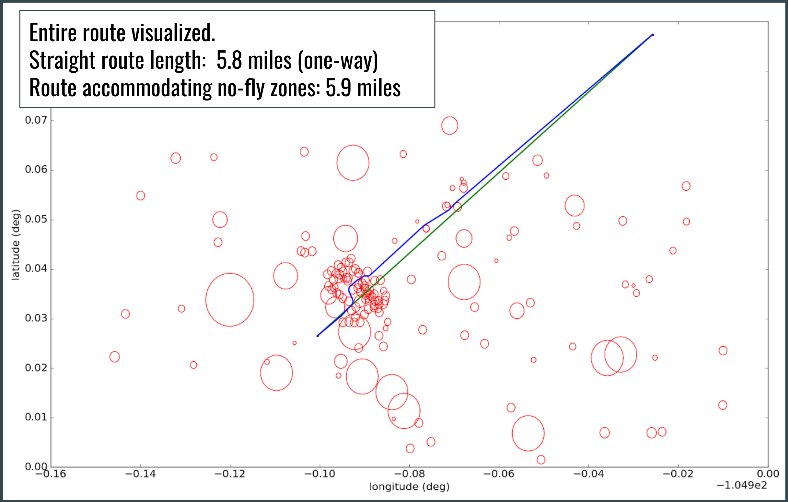
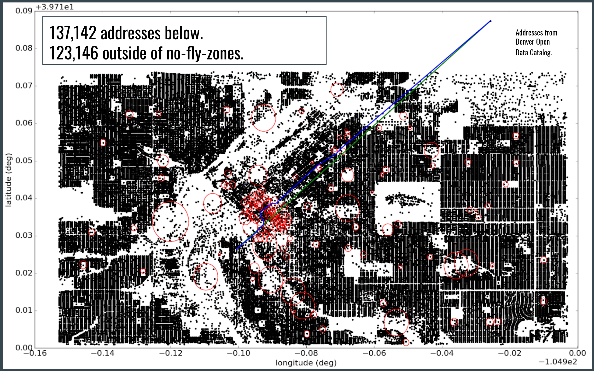
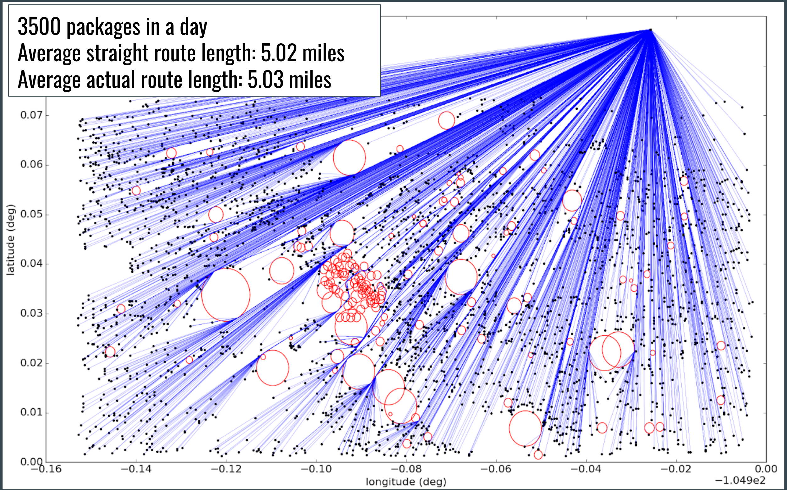

# Unmanned Aerial Vehicle (UAV) Package Delivery Simulation for Metro Denver

## Introduction
Amazon, Google, and the UPS continue to investigate unmanned aerial vehicles (UAVs)
for home package delivery. NASA and the FAA are attempting to develop the
technological and regulatory infrastructure needed for UAVs in many
industries, including package delivery. However, decisions are being made by
both agencies that would affect delivery service without a public model to
evaluate the effects of their decisions. For instance, should heliports at
hospitals, police departments, and news agencies continue to require 5 mile
radius no-fly zones? Should schools, government buildings, major shopping
areas and parks also be protected by no-fly zones, and if so how large? And
for delivery services and potential customers, how will package delivery time
and UAV requirements be affected by these decisions?

## Goal
This project develops a UAV delivery model to answer the following questions 
for Metro Denver:
* How many delivery addresses are affected by no-fly zones?
* What is the average UAV package delivery distance, and how is it affected by no-fly zones?

## Data  
The following data (with link to source) were required for the simulation:  
* Delivery addresses ([Denver Open Data Catalog](https://www.denvergov.org/opendata))
* School addresses ([Google Maps API](https://developers.google.com/maps/documentation))
* Hospital, law enforcement, and government building addresses ([Google Maps API](https://developers.google.com/maps/documentation))
* Sports facility and convention center addresses ([Google Maps API](https://developers.google.com/maps/documentation))
* Denver skyscrapers ([scraped from Wikipedia](https://en.wikipedia.org/wiki/List_of_tallest_buildings_in_Denver))  

Addresses were managed as (latitude, longitude) tuples.

Two dataframes were created: one for delivery addresses and the other for no-fly 
zones. As drones should not fly higher than 500' per the FAA, many skyscrapers obstruct the flight path and therefore count as no-fly zones for this analysis.  Radii for the no-fly zones were based on the 
[FAA's "No Drone Zone" documentation.](https://www.faa.gov/uas/resources/community_engagement/no_drone_zone/)  

## Pathing  
UAV (drone) package deliveries were assumed to originate from the UPS Freight facility 
north of 270, just north of downtown.  Eligible delivery addresses were contained 
in the rectangle formed by I70 to the north, Sheridan Boulevard to the west, 
Alameda Avenue to the south, and Monaco Parkway to the east.  

In the abscence of no-fly zones and skyscrapers, the delivery flight path would be
easy to calculate and straight "as-the-crow-flies."  However, no-fly zones may
obstruct the path and require the drone to fly around them.  Therefore a pathing algorithm
was created to find the shortest path between two points assuming circular obstructions
may be present.  It's assumed that no-fly zones can be specified as a circle: (latitude, longitude) for the center and a given radius.

A recursive approach was taken to perform the pathing, as shown in this pseudocode:  
```
get_route(start, end, obstructions)
    if there are no obstructions between the start and end points
        travel a straight path from start to end
    else
        go around to the edge of the nearest obstruction
        define a new start point
        get_route(start, end, obstructions)
```

This algorithm was implemented in `src/pathing_demo.py`.  This file randomly 
locates a start point, an end point, and circular no-fly zones, then attempts 
to navigate from the start to the end and plot the resulting path.

You may execute this code from the command line:  
```
$ python pathing_demo.py
```
to perform your own simulations.  Examples of four simulations are shown below.


The dashed green path shows the straight path between the two points, while the blue
line plots the approximate path using points on the circle quadrants. Exact tangents
are found later using a smoothing process.  

## Simulation
The gif below shows an aerial view of a UAV package delivery on Google Maps from 
the UPS Freight facility north of 270 to an address at 13th and Kalamath, just southwest
of downtown.  The UAV must navigate the numerous no-fly zones downtown to deliver the package.
The green line indicates the straight path and the blue line the path necessary
to navigate the no-fly zones. The icon in the middle indicates the UAV.

<br>
<br>
The entire delivery path along with no-fly zones is plotted below.

<br>
<br>
Here is the delivery path along with possible delivery addresses.  From address
locations, it's easy to discern Denver landmarks like Sloan's Lake, the Platte River, 
City Park and Cherry Creek in this image.  90% of potential delivery addresses lie 
outside the no-fly zones.

<br>
<br>
The average number of daily small package deliveries to the Denver metropolitan area of this
study was estimated using Denver's metropolitan population and [package delivery 
information from the USPS](https://facts.usps.com/table-facts/). The results: 
approximately 3500 small packages per day.  For each package a delivery address 
was chosen randomly, then routes were calculated and plotted below.

The average straight path delivery was just over 5 miles, and the actual distance the UAV would
have to fly was negligibly longer.  The simulation was repeated numerous times and these results
were consistent.

Beside calculating delivery distances, the figure also shows UAV "highways" that form
based on delivery addresses and "funnels" created by no-fly zones.  A homeowner may believe
that, because their home is near a no-fly zone, that there will not be significant UAV traffic.
If their home is near one of the funnels, the exact opposite will be true.  Planning beyond
shortest distance will likely be required to control UAV traffic in some areas.
<br>
<br>
## Conclusions
This study started with two goals.


* How many delivery addresses are affected by no-fly zones?
* What is the average UAV package delivery distance, and how is it affected by no-fly zones?


and estimating that 1/100th the small packages will be serviced by UAVs leads to approximately

UAV (drone) package deliveries were assumed to originate from the UPS Freight facility 
north of 270, just north of downtown.  Eligible delivery addresses were contained 

Data were brought together into a pandas dataframes for delivery address
answers these questions by creating
package delivery models for Denver County. "As the crow flies" routes are compared
to more constrained routes that include no-fly zones for many locations.
Routing problems solved via graph theory using data aggregated from the US. Census,
the DenverOpenData catalog, and Google Maps via the JavaScript API. Results are 
visualized on Google Maps and in matplotlib.

The second part of the project addresses the final step of delivery: package
drop-off at the customer's home. In Amazon's conception of this step, the
customer places a 1'x1' sign with the Amazon logo flat on the ground near their
home where they want the UAV to land. As the UAV nears the home it switches
from GPS navigation to an on-board camera that looks for the sign and positions
itself over it to land. This is too restrictive. It should be possible to classify
potential landing zones around a home using high resolution satellite images.
These landing zones could serve as default landing locations that would not require
the customer's presence for deliveries. This portion of the project demonstrates
proof-of-concept for one city block.  Analysis consisted of training and
testing a random forest classifier on aerial images.
